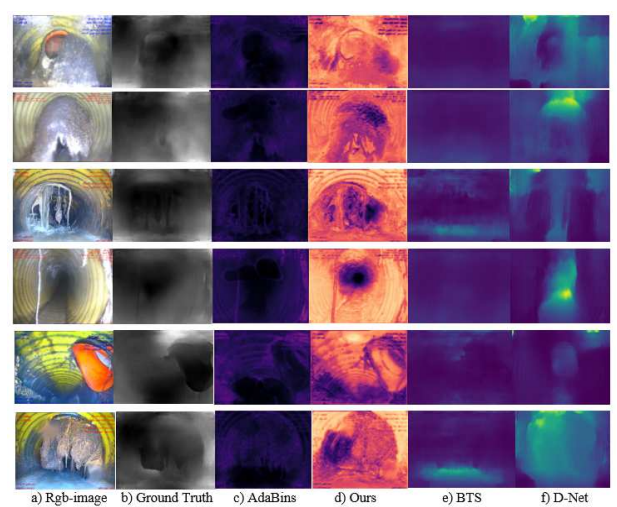

# Depth_Estimation

Estimating the depth of a scene from single monocular color images is a fundamental problem in image understanding. Depth estimation is a critical function for robotic tasks such as localization, mapping, and obstacle detection. Recent advancements in deep convolutional neural networks have provided reliable results in this area.

Due to the low cost and relatively small size of monocular cameras, the performance of neural networks for depth estimation from a single RGB image has significantly improved. Inspector robots operate inside sewer pipes, navigating ambiguous environments filled with various contaminants and obstacles. By understanding the environment within the pipe and analyzing images from the monocular camera, the robot can navigate more safely and perform its mission more effectively.

This project introduces a new deep neural network called **SepiDepthASPP**. Our approach combines ASPP and adaptive bins to extract strong global and local contextual features at multiple scales, subsequently translating them to higher resolutions for clearer depth maps. This network is specifically designed for images captured inside sewer pipes, enabling more accurate detail estimation in the resulting depth maps. The network is trained on datasets obtained from within sewer pipes, aiding the robot in comprehending its internal environment.

## Implementation of This Paper
**AdaBins-ASPP** is trained on sewer pipe images and is based on the modification of the AdaBins network structure by integrating ASPP.



## Installation
1. Clone the repository:
   ```bash
   git clone https://github.com/YourUsername/Depth_Estimation.git
   
2. Navigate to the project directory:
   ```bash
   cd Depth_Estimation
   
3. Install the required dependencies:
   ```bash
   pip install -r requirements.txt
   
# Usage
4. Start Jupyter Notebook from your terminal:
   ```bash
   Open the adabinfinal.ipynb file from the Jupyter interface.


